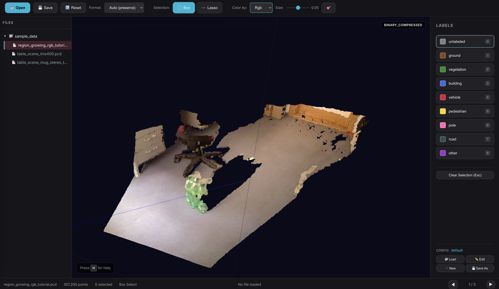

# Point Cloud Labeler

[](https://github.com/sddavis14/semantic-segmentation-cloud-labeler/actions/workflows/ci.yml)
[](LICENSE)

A modern, web-based tool for labeling 3D LiDAR point clouds for semantic segmentation. Built with Three.js and a high-performance native C++ PCD parser.



## ✨ Features

- **High-Performance Parsing**: Native C++ addon for fast PCD file loading
- **Multiple Save Formats**: ASCII, Binary, and LZF-compressed Binary
- **Format Display**: Shows current file format (ASCII/BINARY) in viewport badge
- **Dynamic Colorization**: Color by label, RGB, intensity, or any field
- **Selection Tools**: Box and lasso selection for precise labeling
- **Configurable Labels**: Add custom labels with unique colors
- **Keyboard Shortcuts**: Full keyboard navigation (press `H` for cheat sheet)
- **Modern UI**: Dark theme with glassmorphism design

## 🚀 Quick Start

### Try on GitHub Codespaces (No Installation)

[](https://codespaces.new/sddavis14/semantic-segmentation-cloud-labeler)

1. Click the badge above to launch a cloud dev environment
2. Wait for the environment to build (~2 min first time)
3. Run `npm start -- --dir sample_data` in the terminal
4. Click the forwarded port URL to open the app

### Local Installation

#### Prerequisites

- **Node.js 24+**
- **CMake 3.14+**
- **C++ compiler** (Xcode CLI tools on macOS, build-essential on Linux)

#### Installation

```bash
# Clone and install
git clone https://github.com/sddavis14/semantic-segmentation-cloud-labeler.git labeling_tool
cd labeling_tool
npm install

# Start the server
npm start
```

Open [http://localhost:3000](http://localhost:3000) in your browser.

### Build Commands

| Command | Description |
|---------|-------------|
| `npm run build` | Full build (CMake library + Node addon) |
| `npm run build:cmake` | Build C++ library only |
| `npm run build:node` | Rebuild Node addon (requires library) |
| `npm test` | Run C++ unit tests |

### Open a Folder

```bash
# Start with a specific folder
npm start -- --dir /path/to/pcd/files
```

### Change the Port

The server runs on port 3000 by default. To use a different port, set the `PORT` environment variable:

```bash
# Linux/macOS
PORT=8080 npm start

# Windows (PowerShell)
$env:PORT=8080; npm start

# Windows (Command Prompt)
set PORT=8080 && npm start
```

## ⌨️ Keyboard Shortcuts

| Key | Action |
|-----|--------|
| `H` or `?` | Show keyboard shortcuts |
| `N` / `Right Arrow` | Next file |
| `P` / `Left Arrow` | Previous file |
| `Ctrl+S` | Save labels |
| `Ctrl+O` | Open folder |
| `0-9` | Select current label |
| `Escape` | Clear selection |
| `B` | Box select mode |
| `L` | Lasso select mode |
| `R` | Reset camera |
| `C` | Cycle colorization |

## 🖱️ Mouse Controls

| Action | Control |
|--------|---------|
| **Select points** | Left-click + drag (box or lasso) |
| **Rotate camera** | Right-click + drag |
| **Pan camera** | Shift + Right-click + drag |
| **Zoom** | Scroll wheel or Middle-click + drag |

## 💾 Save Formats

Use the **Format** dropdown to choose output format:

| Format | Description |
|--------|-------------|
| Auto | Preserves original file format |
| ASCII | Human-readable text format |
| Binary | Efficient binary format |
| Compressed | LZF-compressed binary (smallest) |

## 📁 Project Structure

```
labeling_tool/
├── native/src/           # C++ native addon
│   ├── pcd_parser.cpp    # PCD parser with LZF compression
│   └── bindings.cpp      # Node.js N-API bindings
├── public/               # Frontend
│   ├── js/               # JavaScript modules
│   └── css/              # Stylesheets
├── sample_data/          # Example PCD files
├── server.js             # Express server
└── labels.yaml           # Label configuration
```

## 🔧 Troubleshooting

### Native addon build errors

```bash
# Ensure node-gyp is installed
npm install -g node-gyp

# Clean rebuild
rm -rf build node_modules
npm install
```

### "Native parser not available"

The C++ addon failed to build. Ensure you have:
- A C++ compiler (`g++` or `clang++`)
- Python 3 (required by node-gyp)

## 📄 License

[MIT](LICENSE) © Spencer Davis
